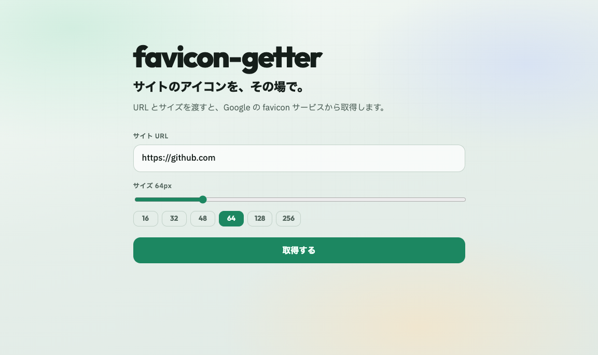

# favicon-getter

指定したサイトの favicon を、URL とサイズをパラメーターで取得する小さなツールです。

**公開 URL:** [https://favicon-getter.vercel.app](https://favicon-getter.vercel.app)



## 作った目的

業務では Nuxt / Rails / AWS などを扱う一方で、個人開発では「アイデアを短時間で形にし、CLI・API・Web UI・デプロイまで一通り完成させる」ことを意識しています。favicon 取得は題材としては小さいですが、利用形態を複数用意して公開まで持っていく練習として作りました。

## 使用技術

| 区分 | 技術 |
|------|------|
| Runtime | Node.js (ESM) |
| Web / API | 素の HTTP サーバー / Vercel Serverless Functions |
| Favicon 取得 | Google `s2/favicons`（非公式エンドポイント） |
| フロント | HTML / CSS / Vanilla JS |
| テスト | Node.js 組み込み Test Runner (`node:test`) |
| デプロイ | Vercel |
| コンテナ | Dockerfile（Apple Container / OCI 互換） |

## 工夫した点

- **同じコアを複数経路で再利用** — `normalizeDomain` / `parseSize` / `getFaviconUrl` / `getFavicon` を共通化し、CLI・ローカルサーバー・Vercel API から呼び出す
- **入力検証** — `size` は 16〜512 の整数に制限。不正値は API で 400
- **上流障害の分離** — Google 側の失敗は 502。メソッド不正は 405
- **安全側の取得** — fetch タイムアウト（8 秒）とレスポンスサイズ上限（512KB）
- **テスト可能な取得処理** — `getFavicon` に `fetch` を注入でき、Google API をモックして検証

## 制約事項

- **Google の favicon サービスへのラッパー**です。対象サイトの HTML を解析して `<link rel="icon">` を辿る実装ではありません
- Google 側のキャッシュ・画質・サイズ選択に依存します。希望サイズが無い場合は別サイズ（例: 16px）が返ることがあります
- Google のエンドポイントは公式ドキュメント化された公開 API ではないため、仕様変更やレート制限の影響を受ける可能性があります
- 現状の公開 API にユーザー単位のレート制限は付けていません（CDN キャッシュ `max-age=3600` のみ）

```
https://www.google.com/s2/favicons?domain=<URL>&sz=<サイズ>
```

## 使い方

### 公開サービス（Vercel）

- UI: [https://favicon-getter.vercel.app](https://favicon-getter.vercel.app)
- API: `https://favicon-getter.vercel.app/api/favicon?url=https://github.com&size=64`

```bash
npx vercel
npx vercel --prod
```

### ローカルサーバー

```bash
npm start
# → http://localhost:3000
```

### CLI

```bash
node bin/cli.js https://github.com 64
node bin/cli.js --url https://www.google.com --size 128 --out google.png
node bin/cli.js --url example.com --size 32 --url-only
```

### ライブラリ

```js
import { getFaviconUrl, getFavicon } from "./src/index.js";

const iconUrl = getFaviconUrl("https://github.com", 64);
// => https://www.google.com/s2/favicons?domain=github.com&sz=64

const { buffer, contentType, sourceUrl } = await getFavicon(
  "https://github.com",
  128
);
```

### テスト

```bash
npm test
```

## パラメーター

| 名前 | 説明 | 例 |
|------|------|-----|
| `url` | 取得したいサイトの URL またはドメイン | `https://github.com` |
| `size` | 希望するアイコンサイズ（px）。**16〜512 の整数** | `32`, `48`, `64`, `128` |

## ライセンス

MIT（[LICENSE](./LICENSE)）

## リポジトリ

- https://github.com/jun01t/favicon-getter
